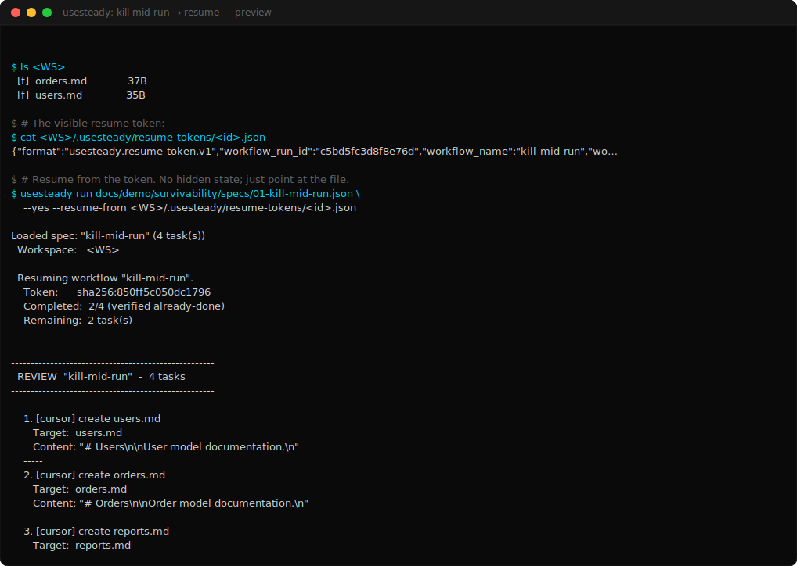

# Demo 01 — Kill mid-run → resume

> **Proves:** workflow survivability — long workflows can be interrupted and resumed without losing progress.

<p align="center">
  <a href="../assets/survivability/01-kill-mid-run.svg">
    
  </a>
</p>

> ▶ Animated SVG: [`01-kill-mid-run.svg`](../assets/survivability/01-kill-mid-run.svg) ·
> 📼 Asciicast: [`01-kill-mid-run.cast`](../assets/survivability/01-kill-mid-run.cast) ·
> 📜 Plain-text session: [`01-kill-mid-run.session.txt`](../assets/survivability/01-kill-mid-run.session.txt)

## The story

You have a 4-task documentation workflow. It runs. Halfway through, your machine reboots / your CI runner times out / you hit Ctrl+C. The first two tasks completed (and their files are on disk). The last two never started.

You don't want to redo the work. You also don't want hidden state to "pick up where it left off" — that's how trust breaks. You want **explicit, verifiable continuation**.

UseSteady's answer: a resume token that's just a file in your workspace.

## The spec

```json
{
  "name": "kill-mid-run",
  "tasks": [
    { "input": "create users.md",   "operationType": "write_file", "targetFiles": ["users.md"],   "content": "..." },
    { "input": "create orders.md",  "operationType": "write_file", "targetFiles": ["orders.md"],  "content": "..." },
    { "input": "create reports.md", "operationType": "write_file", "targetFiles": ["reports.md"], "content": "..." },
    { "input": "create README.md",  "operationType": "write_file", "targetFiles": ["README.md"],  "content": "..." }
  ]
}
```

Source: [`specs/01-kill-mid-run.json`](specs/01-kill-mid-run.json)

## The flow

1. **Run** the workflow. After each task UseSteady atomic-rename-writes a resume token to `<workspace>/.usesteady/resume-tokens/<runId>.json`. Token write is a side effect of completion — no extra step.

2. **Interrupt** (simulated in the capture by truncating the token to `completed_task_count: 2` and deleting the two files that hadn't been finalized in the imagined run). On a real machine this is what you get when the process dies after task 2 wrote its file but before task 3 started.

3. **Inspect** the token. It's a single JSON file. You can `cat` it. It tells you:
   - which workflow it belongs to (`workflow_spec_hash`),
   - which workspace (`workspace_root`),
   - which tasks already completed (`completed_task_summaries`),
   - when it was issued.

4. **Resume** with `--resume-from <token>`. UseSteady:
   - validates the token against the current spec hash + workspace,
   - **verifies each "already-done" claim against current disk state** (this is the key step — see Demo 02 for what happens when verification fails),
   - pre-advances past the verified tasks,
   - shows you the remaining work in the standard review frame,
   - runs only the remaining tasks.

5. **Verify** the final state. All four files present and correct.

## The captured session

[`docs/demo/assets/survivability/01-kill-mid-run.session.txt`](../assets/survivability/01-kill-mid-run.session.txt)

Key moment from the capture:

```
$ usesteady run docs/demo/survivability/specs/01-kill-mid-run.json \
    --yes --resume-from <WS>/.usesteady/resume-tokens/<id>.json

Loaded spec: "kill-mid-run" (4 task(s))
  Workspace:   <WS>

  Resuming workflow "kill-mid-run".
    Token:      sha256:850ff5c050dc1796
    Completed:  2/4 (verified already-done)
    Remaining:  2 task(s)
```

Note what's visible and what isn't:

- **Visible:** spec, workspace, token id, completed count, remaining count.
- **Invisible by design:** nothing. There IS no other state.

## The token (operator-visible)

[`docs/demo/assets/survivability/01-kill-mid-run.token.json`](../assets/survivability/01-kill-mid-run.token.json)

It's plain JSON. You can grep it, diff it, ship it as a CI artifact, attach it to a Slack thread. There's no shadow store anywhere else.

## Why this matters

Most "resumable" AI workflows treat the failed run as a checkpoint to silently inherit. You don't see what they're carrying forward; you trust them. UseSteady inverts that. Resume happens because you handed it the token — a visible file that you can read, verify, or delete.

The category line: **survivability without hidden continuation**.
