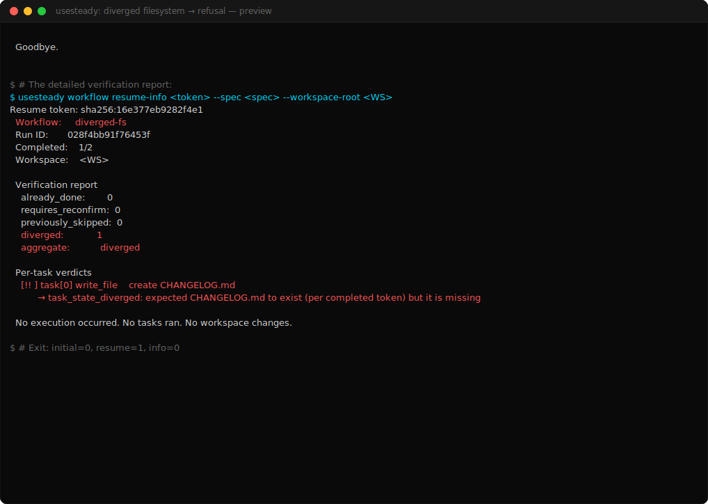

# Demo 02 — Diverged filesystem → refusal

> **Proves:** integrity. The resume path verifies its "already-done" claims against current disk state and refuses on inconsistency.

<p align="center">
  <a href="../assets/survivability/02-diverged-fs.svg">
    
  </a>
</p>

> ▶ Animated SVG: [`02-diverged-fs.svg`](../assets/survivability/02-diverged-fs.svg) ·
> 📼 Asciicast: [`02-diverged-fs.cast`](../assets/survivability/02-diverged-fs.cast) ·
> 📜 Plain-text session: [`02-diverged-fs.session.txt`](../assets/survivability/02-diverged-fs.session.txt)

## The story

A workflow ran, partially completed, wrote a token. Then somebody (a co-worker, a deploy script, a stray `git clean`, a backup restore) modified the workspace outside the workflow's control. The token still says "task[0] is done," but the file task[0] supposedly created is gone.

A naive "resume" would happily skip task[0] (it's marked done!) and proceed. UseSteady refuses. It re-verifies.

## The spec

```json
{
  "name": "diverged-fs",
  "tasks": [
    { "input": "create CHANGELOG.md", "operationType": "write_file", "targetFiles": ["CHANGELOG.md"], "content": "..." },
    { "input": "create VERSION",      "operationType": "write_file", "targetFiles": ["VERSION"],      "content": "..." }
  ]
}
```

Source: [`specs/02-diverged-fs.json`](specs/02-diverged-fs.json)

## The flow

1. **Run** the 2-task workflow. Both files appear. Token is written reflecting `completed_task_count: 2`.

2. **Diverge** the workspace: in the capture, both files are deleted and the token is truncated to `completed_task_count: 1`. This simulates the real-world case where the workflow ran one task, was interrupted, and then something outside the workflow deleted the file that task[0] had created.

3. **Attempt to resume.** UseSteady re-verifies: the token claims `CHANGELOG.md` exists, but disk says it doesn't. **Resume refuses with exit code 2.**

   ```
   ✗ Resume refused: workspace state diverged from token.
       1 task(s) cannot be verified as already-done.
   ```

4. **Use `workflow resume-info`** to see the detailed verdict. It explains exactly which task diverged and why.

## The captured session

[`docs/demo/assets/survivability/02-diverged-fs.session.txt`](../assets/survivability/02-diverged-fs.session.txt)

Key moment:

```
Verification report
    already_done:        0
    requires_reconfirm:  0
    previously_skipped:  0
    diverged:            1
    aggregate:           diverged

  Per-task verdicts
    [!! ] task[0] write_file    create CHANGELOG.md
          → task_state_diverged: expected CHANGELOG.md to exist
            (per completed token) but it is missing
```

## What didn't happen

- **No silent re-execution.** UseSteady didn't quietly re-run task[0] because the token said it was done. It saw the inconsistency and stopped.
- **No silent skip.** UseSteady didn't trust the token over the disk. It probed the disk and refused when they disagreed.
- **No mutation.** The refused resume changed nothing in the workspace.

## What the operator does next

The refusal is informational, not a failure. The operator now knows:

1. The workspace and the token disagree.
2. The specific task and reason.
3. They need to reconcile manually — either restore the file from backup and re-resume, or delete the token and start a fresh run.

UseSteady's job here is **to make divergence visible**, not to guess what to do about it.

## Why this matters

In a world of "AI agents will figure it out," refusing to figure it out is a feature. Long workflows touch real systems. When the world's state moves out from under a checkpoint, the only honest answer is **stop and tell the operator**.

The category line: **survivability without hidden continuation**.
