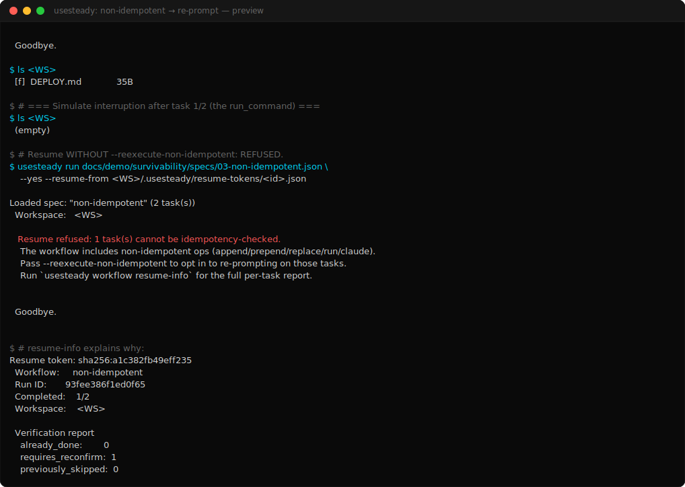

# Demo 03 — Non-idempotent task → re-prompt / refusal

> **Proves:** authority discipline. Resume across a non-idempotent task requires an explicit operator opt-in (`--reexecute-non-idempotent`). It is never silent.

<p align="center">
  <a href="../assets/survivability/03-non-idempotent.svg">
    
  </a>
</p>

> ▶ Animated SVG: [`03-non-idempotent.svg`](../assets/survivability/03-non-idempotent.svg) ·
> 📼 Asciicast: [`03-non-idempotent.cast`](../assets/survivability/03-non-idempotent.cast) ·
> 📜 Plain-text session: [`03-non-idempotent.session.txt`](../assets/survivability/03-non-idempotent.session.txt)

## The story

Your workflow runs a `run_command` step early (let's say `npm run build`). It succeeds. The workflow gets interrupted before completing the rest. You want to resume.

Question: should the resume re-run `npm run build`? UseSteady refuses to guess. A command is not a file — it has no idempotency signal on disk. Re-running it might be safe (idempotent build) or destructive (writes to a shared cache, calls a webhook, charges money). Only the operator knows.

So the default is **refuse**. Resume requires you to opt in with `--reexecute-non-idempotent`.

## The spec

```json
{
  "name": "non-idempotent",
  "tasks": [
    { "input": "run build",        "operationType": "run_command", "command": "echo built" },
    { "input": "create DEPLOY.md", "operationType": "write_file",  "targetFiles": ["DEPLOY.md"], "content": "..." }
  ]
}
```

Source: [`specs/03-non-idempotent.json`](specs/03-non-idempotent.json)

## The idempotency taxonomy

| Class | Op types | Resume behavior |
|-------|----------|-----------------|
| `checkable` | `write_file`, `delete_file`, `rename`, `create_dir` | Validator probes disk; auto-classifies `already_done` / `task_state_diverged`. |
| `requires_reconfirm` | `replace`, `append_file`, `prepend_file`, `run_command` | Refuses resume unless `--reexecute-non-idempotent` is passed. |
| `interpretive` | `claude` runtime tasks | Refuses resume unless `--reexecute-non-idempotent` is passed. |

`requires_reconfirm` is a deliberate "we cannot answer this from the disk alone — operator must answer."

## The flow

1. **Run** the workflow once. Both tasks complete. Token reflects `completed_task_count: 2`.

2. **Simulate interruption** after task[0] (the `run_command`): truncate token to `completed_task_count: 1`, delete `DEPLOY.md`.

3. **Attempt to resume WITHOUT the opt-in.** UseSteady refuses:

   ```
   ✗ Resume refused: 1 task(s) cannot be idempotency-checked.
       The workflow includes non-idempotent ops (append/prepend/replace/run/claude).
       Pass --reexecute-non-idempotent to opt in to re-prompting on those tasks.
   ```

4. **Use `workflow resume-info`** to see exactly which task triggered the refusal:

   ```
   Per-task verdicts
       [?  ] task[0] run_command   run build
             → requires_reconfirm: op type "run_command" is not
                idempotency-checkable; operator must confirm
   ```

5. **Resume WITH the opt-in.** UseSteady proceeds — the operator has explicitly acknowledged that task[0] might have been re-runnable but they've decided to skip it on the way to completing the remainder.

   ```
   $ usesteady run spec.json --yes \
       --resume-from <token> \
       --reexecute-non-idempotent
   ```

## The captured session

[`docs/demo/assets/survivability/03-non-idempotent.session.txt`](../assets/survivability/03-non-idempotent.session.txt)

## What `--reexecute-non-idempotent` does NOT do

- It does **not** bypass per-task approval. Each task still goes through the normal approval flow.
- It does **not** re-execute the task automatically. It marks the task as "accepted at original-run time, treat as done, continue past it." If the operator wants to actually re-run a non-idempotent task, they delete the token and start a fresh run.
- It does **not** transfer approval authority. `--yes` on the original run is gone. `--yes` on the resume is a fresh approval, scoped to this resume only.

## Why this matters

The default-refuse posture is what makes resume **safe to ship in CI**. A pipeline that auto-resumes on flaky runs cannot accidentally re-charge a customer, re-deploy a build, or re-send a webhook — because the resume will refuse until an operator (or the pipeline owner, declaratively) consents.

The category line: **survivability without hidden continuation**.
