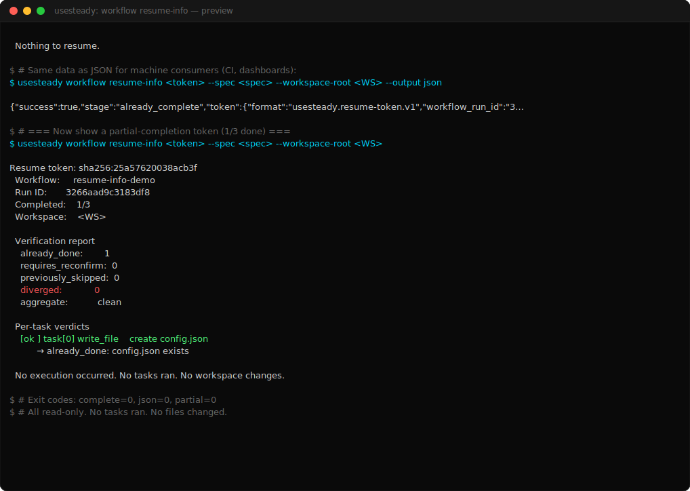

# Demo 04 — `workflow resume-info` inspection

> **Proves:** visibility. A resume token can be fully inspected, validated, and verified without executing anything.

<p align="center">
  <a href="../assets/survivability/04-resume-info.svg">
    
  </a>
</p>

> ▶ Animated SVG: [`04-resume-info.svg`](../assets/survivability/04-resume-info.svg) ·
> 📼 Asciicast: [`04-resume-info.cast`](../assets/survivability/04-resume-info.cast) ·
> 📜 Plain-text session: [`04-resume-info.session.txt`](../assets/survivability/04-resume-info.session.txt)

## The story

You have a resume token sitting in your workspace. Before you risk running anything, you want to know:

- Which workflow does it belong to?
- Which workspace was it issued in?
- How many tasks did it record as complete?
- Does each "already-done" claim still match the workspace?
- Would a resume be `clean`, `needs_reconfirm`, or `diverged`?

`workflow resume-info` answers all of those without executing a single task.

## Surface

```
usesteady workflow resume-info <token.json> --spec <spec.json>
                                            [--workspace-root <dir>]
                                            [--output json]
```

Like `workflow inspect`, this command is **zero-authority**. It reads the token, reads the spec, probes the filesystem read-only (`existsSync`, `statSync`), and prints a report. It never writes a token, never approves anything, never executes a task.

## Three shapes

The captured session shows the same token rendered three ways:

### 1. Text mode, all-complete

```
Resume token reports the workflow is already complete.
    Workflow: resume-info-demo
    Run ID:   <id>
    Tasks:    3/3
  Nothing to resume.
```

### 2. JSON mode, all-complete

Same data, single-line JSON, suitable for piping into `jq` or attaching to CI logs. See [`04-resume-info.json`](../assets/survivability/04-resume-info.json).

### 3. Text mode, partial-completion

When the token reflects work-in-progress (e.g. 1/3 completed), the report shows the per-task verdict:

```
Resume token: sha256:<id>
Workflow:     resume-info-demo
Run ID:       <id>
Completed:    1/3
Workspace:    <WS>

Verification report
    already_done:        1
    requires_reconfirm:  0
    previously_skipped:  0
    diverged:            0
    aggregate:           clean

Per-task verdicts
    [ok ] task[0] write_file    create config.json
          → already_done: config.json exists

No execution occurred. No tasks ran. No workspace changes.
```

The `[ok ] / [skip] / [?  ] / [!! ]` markers make the verdict glanceable. The `aggregate` line is the load-bearing signal — that's what a resume invocation would gate on.

## The captured session

[`docs/demo/assets/survivability/04-resume-info.session.txt`](../assets/survivability/04-resume-info.session.txt)

## Exit codes

| Exit | Meaning |
|------|---------|
| 0 | Inspection succeeded (clean / needs_reconfirm / diverged are all "report delivered"). |
| 1 | Token unreadable, malformed, unsupported format, or workspace mismatch. |
| 2 | Bad invocation (missing `--spec`, etc). |

The report content is the deliverable. A `diverged` aggregate is still exit 0 because the inspection itself succeeded — the report just happens to say resume would refuse.

## What this enables

- **CI dashboards.** A nightly job that grabs every workspace's resume token, runs `resume-info --output json`, and posts a "stuck workflows" view to Slack.
- **Audit trails.** The JSON output is content-addressable (sorted keys); it can be diffed across days to track operator interventions.
- **Pre-merge checks.** A pre-commit hook that verifies no in-flight workflow tokens exist before a branch is merged.
- **Operator confidence.** Looking at a token before resuming is a 100ms operation. It's the cheap honest answer.

## Why this matters

Most "observability" for AI workflows is post-hoc and interpretive — logs, traces, vibes. `resume-info` is **structural and deterministic**: same token + same workspace + same spec → same report, every time. That is the kind of visibility regulated teams can build on.

The category line: **survivability without hidden continuation**.
